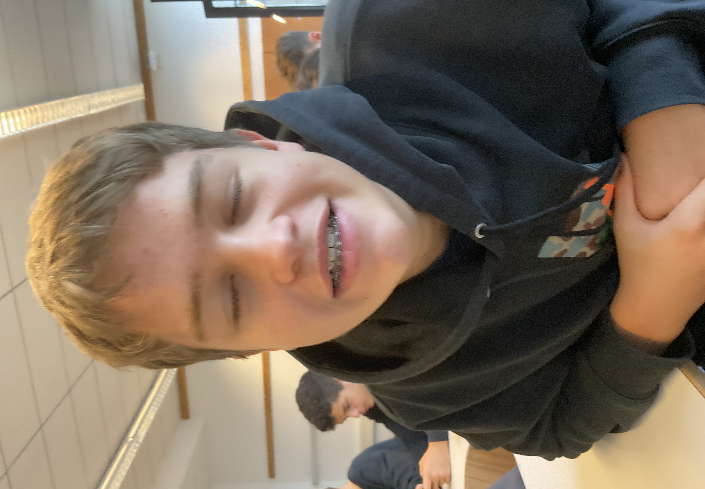
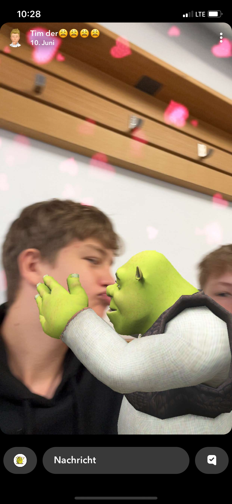

<!DOCTYPE html>
<html lang="de">
<head>
  <meta charset="UTF-8">
  <title>Yannik Raul Heigl Fanpage</title>
  
</head>
<body>

  <h1>Yannik Raul Heigl Fanpage</h1>

  

    <label for="menu"><strong>Kategorie wählen:</strong></label> 
    <select id="menu" onchange="showContent()">
      <option value="">-- bitte wählen --</option>
      <option value="meme">Warum er ein wandelndes Meme ist</option>
      <option value="lisbeln">Warum er lispelt</option>
      <option value="infos">Allgemeine Infos</option>
    </select>
  

  

    <h2>Warum er ein wandelndes Meme ist</h2>
    
Rauli twerkt überall – im Klassenzimmer, auf dem Pausenhof, sogar im Sitzen.

    
Er ruft „GYATT!“ in jeder Situation, in der normale Menschen einfach still bleiben würden.

    
Seine Gesichtsausdrücke wirken wie aus einem Cartoon – kein Frame normal.

    
Wenn man ihn ansieht, denkt man: „Das kann kein echter Mensch sein.“

    
  

  

    <h2>Warum er lispelt</h2>
    
Yannik trägt eine feste Zahnspange – und die sorgt für sein markantes Lispeln.

    
Er versucht Sätze zu beenden, während die Spange einen eigenen Podcast aufnimmt.

    
Er sagt: „Ich find das nicht schlimm.“ – alle anderen: „Doch.“

    
  

  

    <h2>Allgemeine Infos</h2>
    
<strong>Voller Name:</strong> Yannik Raul Heigl

    
<strong>Spitznamen:</strong> Rauli, Gyattman (Gyatti)

    
Er hatte mal einen Irokesenschnitt und lief damit rum, als wär er bei einer Metalband – leider war's nur 7. Klasse.

    
Er diskutiert über alles, sogar über Dinge, die niemand angesprochen hat.

    
Sein Talent? Diskussion starten – verlieren – trotzdem weitermachen.

    
    
  

  <button id="gyatt-button" onclick="spawnGyatts()">GYATT!</button>

  

</body>
</html>
